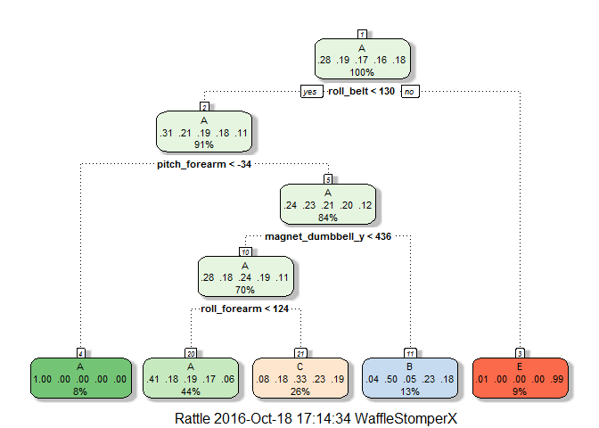
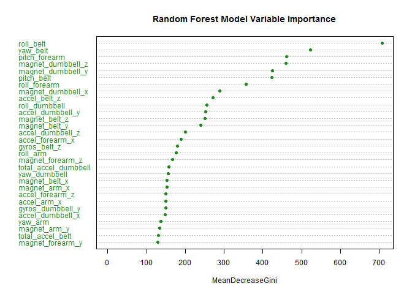

# Practical Machine Learning: Course Project
Tony Matera  
October 16, 2016  


## Background & Introduction

Using devices such as *Jawbone Up*, *Nike FuelBand*, and *Fitbit* it is now possible to collect a large amount of data about personal activity relatively inexpensively. These type of devices are part of the quantified self movement - a group of enthusiasts who take measurements about themselves regularly to improve their health, to find patterns in their behavior, or because they are tech geeks. One thing that people regularly do is quantify *how much* of a particular activity they do, but they rarely quantify *how well they do it*.  
  
In this project, our goal was to see if we could predict the manner in which people did an exercise. We used data from accelerometers on the belt, forearm, arm, and dumbell of 6 participants. They were asked to perform barbell lifts correctly and incorrectly in 5 different ways. More information is available from the website here: http://groupware.les.inf.puc-rio.br/har (see the section on the Weight Lifting Exercise Dataset^[1]^).

## Data & Initial Setup

To begin, we will load the necessary libraries.


```r
cranURL <- "http://cran.rstudio.com/"

if(!require(RGtk2)) {install.packages("RGtk2", repos = cranURL); library(RGtk2)}
if(!require(plyr)) {install.packages("plyr", repos = cranURL); library(plyr)}
if(!require(ggplot2)) {install.packages("ggplot2", repos = cranURL); library(ggplot2)}
if(!require(caret)) {install.packages("caret", repos = cranURL); library(caret)}
if(!require(rpart)) {install.packages("rpart", repos = cranURL); library(rpart)}
if(!require(rpart.plot)) {install.packages("rpart.plot", repos = cranURL); library(rpart.plot)}
if(!require(rattle)) {install.packages("rattle", repos = cranURL); library(rattle)}
if(!require(gbm)) {install.packages("gbm", repos = cranURL); library(gbm)}
if(!require(randomForest)) {install.packages("randomForest", repos = cranURL); library(randomForest)}
```

Next, we must load the training and testing sets. There are blanks, 'NA's, and '#DIV/0!'s, so we must specify that they are to be all coded as **NA** as we load the data sets.


```r
trainURL <- "https://d396qusza40orc.cloudfront.net/predmachlearn/pml-training.csv"
testURL <- "https://d396qusza40orc.cloudfront.net/predmachlearn/pml-testing.csv"

if(!file.exists("./traindata.csv")) {download.file(trainURL, "traindata.csv", mode = "wb")}
if(!file.exists("./testdata.csv")) {download.file(testURL, "./testdata.csv", mode = "wb")}

traindata <- read.csv("./traindata.csv", na.strings = c("NA", "#DIV/0!", ""))
testdata <- read.csv("./testdata.csv", na.strings = c("NA", "#DIV/0!", ""))
```

There are several variables with "near zero variances" that should be removed in order to get the best fitting model. We will use the **nearZeroVar** function to identify them in the training data, and then create a new data set using just the other variables. We will also remove any variables that contain at least 75% **NA**s, as well as the first handful of identifier variables that do not help predict. Then we will reduce the testing data set to only contain the same variables.


```r
nzvVars <- nearZeroVar(traindata)
cleanTrain <- traindata[, -nzvVars]

naSums <- colSums(is.na(cleanTrain))
cleanTrain <- cleanTrain[, naSums < (0.75 * dim(cleanTrain)[1])]
cleanTrain <- cleanTrain[, -c(1:6)]

cleanVars <- colnames(cleanTrain[, -53])
cleanTest <- testdata[, cleanVars]
```

Next we will set the seed and split the training data further into a training subset and a validation set, so we can see how accurate our various models can be. 


```r
set.seed(12341234)
inTrain <- createDataPartition(cleanTrain$classe, p = 0.6, list = FALSE)
training <- cleanTrain[inTrain, ]
validation <- cleanTrain[-inTrain, ]
```

## Prediction Model Building

We will be fitting models using *Decision Trees*, *Gradient Boosting*, and *Random Forests*.

### Decision Tree

Using the **train** function from the **caret** package, we can fit a decision tree model by setting **method = "rpart"**. Below is the resulting model and the decision tree mapped out.


```r
(rpartMod <- train(classe ~ ., data = training, method = "rpart"))
```

```
## CART 
## 
## 11776 samples
##    52 predictor
##     5 classes: 'A', 'B', 'C', 'D', 'E' 
## 
## No pre-processing
## Resampling: Bootstrapped (25 reps) 
## Summary of sample sizes: 11776, 11776, 11776, 11776, 11776, 11776, ... 
## Resampling results across tuning parameters:
## 
##   cp          Accuracy   Kappa     
##   0.03464642  0.5142307  0.36853100
##   0.05920740  0.4145707  0.20499985
##   0.11687233  0.3144828  0.04546246
## 
## Accuracy was used to select the optimal model using  the largest value.
## The final value used for the model was cp = 0.03464642.
```

```r
fancyRpartPlot(rpartMod$finalModel)
```

<!-- -->

Next, we will use the decision tree model to predict the validation data set. To compare our predictions to the actual results, we use a **confusion matrix**.


```r
rpartPredict <- predict(rpartMod, newdata = validation)
(rpartConfMat <- confusionMatrix(validation$classe, rpartPredict))
```

```
## Confusion Matrix and Statistics
## 
##           Reference
## Prediction    A    B    C    D    E
##          A 2036   35  156    0    5
##          B  644  510  364    0    0
##          C  621   36  711    0    0
##          D  581  223  482    0    0
##          E  220  206  379    0  637
## 
## Overall Statistics
##                                           
##                Accuracy : 0.4963          
##                  95% CI : (0.4852, 0.5074)
##     No Information Rate : 0.5228          
##     P-Value [Acc > NIR] : 1               
##                                           
##                   Kappa : 0.3414          
##  Mcnemar's Test P-Value : NA              
## 
## Statistics by Class:
## 
##                      Class: A Class: B Class: C Class: D Class: E
## Sensitivity            0.4963   0.5050  0.33987       NA  0.99221
## Specificity            0.9476   0.8525  0.88582   0.8361  0.88826
## Pos Pred Value         0.9122   0.3360  0.51974       NA  0.44175
## Neg Pred Value         0.6320   0.9210  0.78682       NA  0.99922
## Prevalence             0.5228   0.1287  0.26663   0.0000  0.08183
## Detection Rate         0.2595   0.0650  0.09062   0.0000  0.08119
## Detection Prevalence   0.2845   0.1935  0.17436   0.1639  0.18379
## Balanced Accuracy      0.7220   0.6787  0.61284       NA  0.94023
```

As you can see, the decision tree model did not do very well. It resulted in a 49.63% accuracy, so we must look at other model methods.  
  
### Gradient Boosting

Again using the **train** function from the **caret** package, we can fit a gradient boosting model by setting **method = "gbm"**. Below is the resulting **GBM** model.


```r
gbmControl <- trainControl(method = "repeatedcv", number = 5, repeats = 1)
(gbmMod <- train(classe ~ ., data = training, method = "gbm",
                trControl = gbmControl, verbose = FALSE))
```

```
## Stochastic Gradient Boosting 
## 
## 11776 samples
##    52 predictor
##     5 classes: 'A', 'B', 'C', 'D', 'E' 
## 
## No pre-processing
## Resampling: Cross-Validated (5 fold, repeated 1 times) 
## Summary of sample sizes: 9421, 9421, 9421, 9420, 9421 
## Resampling results across tuning parameters:
## 
##   interaction.depth  n.trees  Accuracy   Kappa    
##   1                   50      0.7506789  0.6838121
##   1                  100      0.8173401  0.7687858
##   1                  150      0.8487601  0.8085641
##   2                   50      0.8497793  0.8096537
##   2                  100      0.9036177  0.8780326
##   2                  150      0.9293482  0.9106017
##   3                   50      0.8950409  0.8670948
##   3                  100      0.9401328  0.9242349
##   3                  150      0.9588998  0.9480046
## 
## Tuning parameter 'shrinkage' was held constant at a value of 0.1
## 
## Tuning parameter 'n.minobsinnode' was held constant at a value of 10
## Accuracy was used to select the optimal model using  the largest value.
## The final values used for the model were n.trees = 150,
##  interaction.depth = 3, shrinkage = 0.1 and n.minobsinnode = 10.
```

As with the decision tree model, we will use the GBM model to predict the validation data set. To compare our predictions to the actual results, we use another **confusion matrix**.


```r
gbmPredict <- predict(gbmMod, newdata = validation)
(gbmConfMat <- confusionMatrix(validation$classe, gbmPredict))
```

```
## Confusion Matrix and Statistics
## 
##           Reference
## Prediction    A    B    C    D    E
##          A 2202   19    4    3    4
##          B   48 1427   41    2    0
##          C    0   36 1317   14    1
##          D    0   10   44 1223    9
##          E    1   21    9   25 1386
## 
## Overall Statistics
##                                          
##                Accuracy : 0.9629         
##                  95% CI : (0.9585, 0.967)
##     No Information Rate : 0.2869         
##     P-Value [Acc > NIR] : < 2.2e-16      
##                                          
##                   Kappa : 0.9531         
##  Mcnemar's Test P-Value : 1.579e-12      
## 
## Statistics by Class:
## 
##                      Class: A Class: B Class: C Class: D Class: E
## Sensitivity            0.9782   0.9432   0.9307   0.9653   0.9900
## Specificity            0.9946   0.9856   0.9921   0.9904   0.9913
## Pos Pred Value         0.9866   0.9401   0.9627   0.9510   0.9612
## Neg Pred Value         0.9913   0.9864   0.9849   0.9933   0.9978
## Prevalence             0.2869   0.1928   0.1803   0.1615   0.1784
## Detection Rate         0.2807   0.1819   0.1679   0.1559   0.1767
## Detection Prevalence   0.2845   0.1935   0.1744   0.1639   0.1838
## Balanced Accuracy      0.9864   0.9644   0.9614   0.9778   0.9907
```

The GBM model performed much better than the decision tree with a 96.29% accuracy. However, we will look at the random forest model to be sure we have found the most accurate model.

### Random Forest

Using the **randomForest** function from the package with the same name, we can fit a random forest model from the training data set. Below is the resulting **random forest** model.


```r
(rfMod <- randomForest(classe ~ ., data = training))
```

```
## 
## Call:
##  randomForest(formula = classe ~ ., data = training) 
##                Type of random forest: classification
##                      Number of trees: 500
## No. of variables tried at each split: 7
## 
##         OOB estimate of  error rate: 0.62%
## Confusion matrix:
##      A    B    C    D    E class.error
## A 3344    2    0    0    2 0.001194743
## B   10 2262    7    0    0 0.007459412
## C    0   18 2031    5    0 0.011197663
## D    0    0   22 1908    0 0.011398964
## E    0    0    1    6 2158 0.003233256
```

Once again, we will use this model to predict the validation data set. To compare our predictions to the actual results, we use yet another **confusion matrix**. 


```r
rfPredict <- predict(rfMod, newdata = validation)
(rfConfMat <- confusionMatrix(validation$classe, rfPredict))
```

```
## Confusion Matrix and Statistics
## 
##           Reference
## Prediction    A    B    C    D    E
##          A 2231    1    0    0    0
##          B    4 1513    1    0    0
##          C    0    2 1365    1    0
##          D    0    0   17 1265    4
##          E    0    0    1    3 1438
## 
## Overall Statistics
##                                          
##                Accuracy : 0.9957         
##                  95% CI : (0.9939, 0.997)
##     No Information Rate : 0.2849         
##     P-Value [Acc > NIR] : < 2.2e-16      
##                                          
##                   Kappa : 0.9945         
##  Mcnemar's Test P-Value : NA             
## 
## Statistics by Class:
## 
##                      Class: A Class: B Class: C Class: D Class: E
## Sensitivity            0.9982   0.9980   0.9863   0.9968   0.9972
## Specificity            0.9998   0.9992   0.9995   0.9968   0.9994
## Pos Pred Value         0.9996   0.9967   0.9978   0.9837   0.9972
## Neg Pred Value         0.9993   0.9995   0.9971   0.9994   0.9994
## Prevalence             0.2849   0.1932   0.1764   0.1617   0.1838
## Detection Rate         0.2843   0.1928   0.1740   0.1612   0.1833
## Detection Prevalence   0.2845   0.1935   0.1744   0.1639   0.1838
## Balanced Accuracy      0.9990   0.9986   0.9929   0.9968   0.9983
```

The random forest model performed the best out of all three methods with an accuracy of 99.57%. As a result, we will be using the random forest model on the testing data set.

We will also plot the *variable importance plot* to show the hierarchy of how much each variable had an effect on the random forest model.


```r
varImpPlot(rfMod, color = "forestgreen", cex = 0.75, pch = 19,
           main = "Random Forest Model Variable Importance")
```

<!-- -->

## Test Data Prediction

Now that we have our best model selected, we will use it to predict the outcome of the 20 testing data set observations.


```r
(testPredict <- predict(rfMod, newdata = cleanTest))
```

```
##  1  2  3  4  5  6  7  8  9 10 11 12 13 14 15 16 17 18 19 20 
##  B  A  B  A  A  E  D  B  A  A  B  C  B  A  E  E  A  B  B  B 
## Levels: A B C D E
```
  
This concludes our analysis.  
  
***
  

######  ^[1]^ Velloso, E.; Bulling, A.; Gellersen, H.; Ugulino, W.; Fuks, H. [Qualitative Activity Recognition of Weight Lifting Exercises](http://groupware.les.inf.puc-rio.br/work.jsf?p1=11201). Proceedings of 4th International Conference in Cooperation with SIGCHI (Augmented Human '13) . Stuttgart, Germany: ACM SIGCHI, 2013.  
